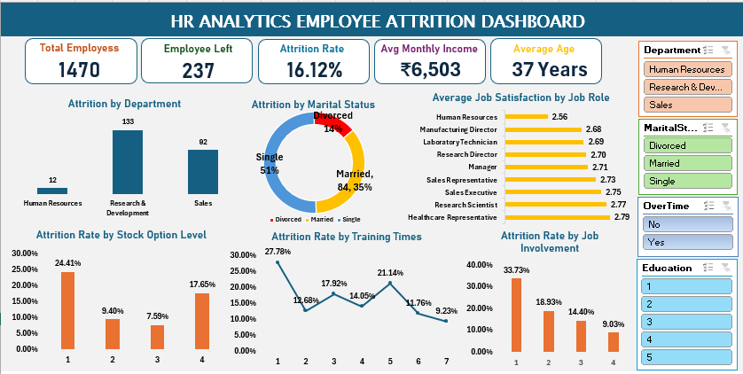

# HR Analytics Employee Attrition Excel Dashboard

## Project Overview

This project presents an interactive HR Analytics dashboard developed in Microsoft Excel to analyze employee attrition and identify the key factors influencing workforce turnover. Using Excel's analytical capabilities, raw employee data has been transformed into meaningful business insights through data cleaning, Pivot Tables, Pivot Charts, formulas, and an interactive dashboard.

The project focuses on employee demographics, department-wise attrition, job involvement, compensation, training, stock options, and job satisfaction to support data-driven HR decision-making.

---

## Project Objectives

- Analyze employee attrition across different departments.
- Identify the major factors influencing employee turnover.
- Evaluate the impact of job involvement, compensation, and stock options on retention.
- Analyze employee training and job satisfaction trends.
- Build an interactive HR Analytics dashboard using Microsoft Excel.
- Generate business insights and recommendations for improving employee retention.

---

## Dataset Information

| Attribute | Details |
|-----------|---------|
| Domain | Human Resources |
| Total Records | 1,470 Employees |
| Tool Used | Microsoft Excel |
| Dashboard Type | Interactive HR Analytics Dashboard |

---

## Project Structure

```text
HR-ANALYTICS-EMPLOYEE-ATTRITION-EXCEL/
│
├── analysis/
│   └── HR_Analytics_Analysis_Report.pdf
│
├── dashboard/
│   └── Dashboard.png
│
├── data/
│   ├── processed/
│   │   └── HR_Analytics_Employee_Attrition_Analysis.xlsx
│   │
│   └── raw/
│       └── WA_Fn-UseC_-HR-Employee-Attrition.csv
│
├── docs/
│   └── adecco_hr_analytics_case_study.pdf
│
├── report/
│   └── HR_Analytics_Project_Report.pdf
│
├── .gitignore
└── README.md
```

---

## Dashboard KPIs

- Total Employees
- Employees Left
- Attrition Rate
- Average Monthly Income
- Average Employee Age

---

## Dashboard Visualizations

- Employee Attrition by Department
- Employee Attrition by Marital Status
- Average Job Satisfaction by Job Role
- Attrition Rate by Stock Option Level
- Attrition Rate by Training Times
- Attrition Rate by Job Involvement

---

## Interactive Filters

The dashboard includes slicers for:

- Department
- Marital Status
- OverTime
- Education
- Gender

---

## Analysis Performed

The project includes a detailed analysis of 20 business questions divided into two levels:

### Basic Analysis (10 Questions)

- Overall Employee Attrition Rate
- Department-wise Attrition
- Average Age of Attrition Employees
- Job Satisfaction by Job Role
- Gender-wise Attrition Analysis
- Average Monthly Income of Attrition Employees
- Distance from Home vs Attrition
- Performance Rating Distribution
- Overtime Employee Analysis
- Average Employee Tenure

### Medium Analysis (10 Questions)

- Top Factors Influencing Attrition
- Job Involvement vs Attrition
- Age vs Job Satisfaction
- Marital Status vs Attrition
- Training vs Attrition
- Work-Life Balance vs Performance
- Stock Options vs Attrition
- Employee Tenure vs Job Satisfaction
- Business Travel vs Job Satisfaction
- Years Since Last Promotion vs Performance

---

## Key Business Insights

- Sales department recorded the highest employee attrition rate.
- Single employees experienced significantly higher attrition than married and divorced employees.
- Employees with lower job involvement showed substantially higher attrition rates.
- Employees without stock options demonstrated the highest employee turnover.
- Regular training programs were associated with improved employee retention.
- Job satisfaction remained relatively consistent across different job roles.
- Compensation, employee age, and years at the company were identified as the strongest factors associated with employee attrition.

---

## Excel Features Used

- Excel Tables
- Pivot Tables
- Pivot Charts
- Slicers
- COUNTIF
- AVERAGE
- CORREL
- Conditional Formatting
- Data Validation
- Percentage Calculations
- Dashboard Design
- Data Visualization

---

## Skills Demonstrated

- Data Cleaning
- Data Analysis
- Human Resource Analytics
- Dashboard Development
- Business Intelligence
- Data Visualization
- KPI Reporting
- Statistical Analysis
- Business Insight Generation
- Microsoft Excel

---

## Dashboard Preview

```markdown

```

---

## Reports Included

### Project Report

Location:

```text
report/HR_Analytics_Project_Report.pdf
```

The project report provides an overview of the project, objectives, methodology, dashboard, findings, recommendations, and conclusion.

### Analysis Report

Location:

## Dashboard Preview

<p align="center">
  
</p>

The analysis report contains detailed solutions for all 20 business questions, including analysis, insights, and recommendations generated during the project.

---

## Conclusion

This project demonstrates the complete HR analytics workflow using Microsoft Excel, from data preparation and analysis to dashboard development and business reporting. The interactive dashboard and supporting reports provide valuable insights into employee attrition, enabling organizations to identify workforce trends, evaluate retention factors, and support data-driven HR decision-making.

The project highlights practical Excel skills, business analysis techniques, and dashboard development capabilities that can be applied to real-world HR analytics scenarios.